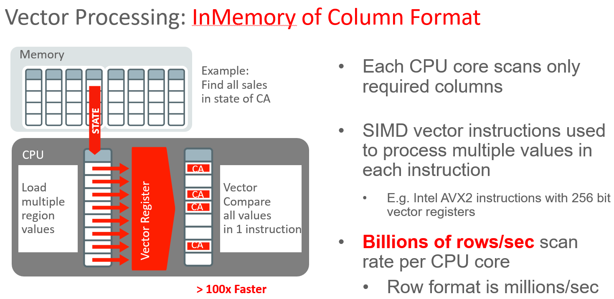
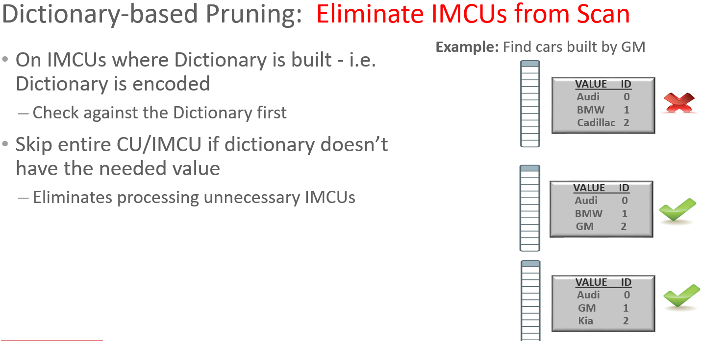
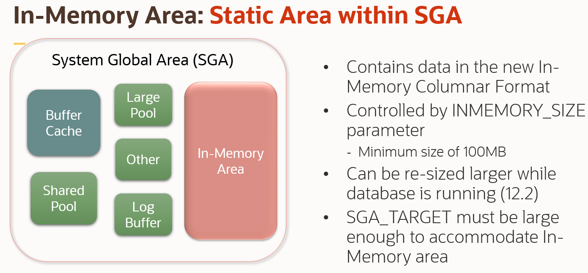
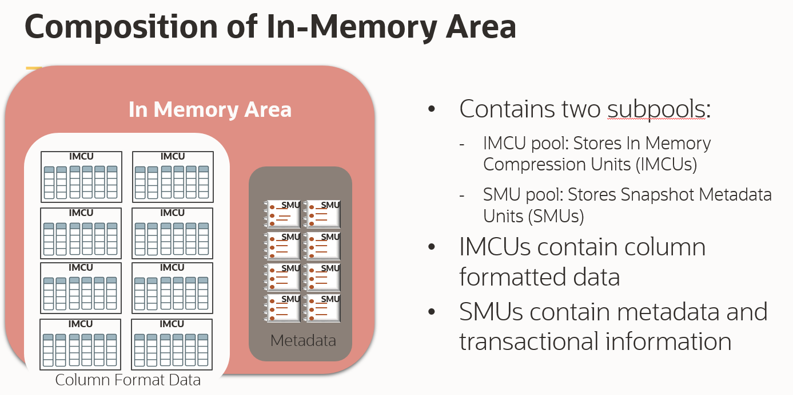

# Workshop Introduction and Overview

## Introduction to Oracle In-Memory

Oracle Database In-Memory adds in-memory functionality to Oracle Database for transparently accelerating analytic queries by orders of magnitude, enabling real-time business decisions. Using Database In-Memory, businesses can instantaneously run analytics and reports that previously took hours or days. Businesses benefit from better decisions made in real-time, resulting in lower costs, improved productivity, and increased competitiveness.

 Oracle Database In-Memory accelerates both Data Warehouses and mixed workload OLTP databases and is easily deployed under any existing application that is compatible with Oracle Database. No application changes are required. Database In-Memory uses Oracle’s mature scale-up, scale-out, and storage-tiering technologies to cost effectively run any size workload. Oracle’s industry leading availability and security features all work transparently with Oracle Database In-Memory, making it the most robust offering on the market.

## **Dual-Format Database**

**Row Format vs. Column Format**

  

Oracle Database has traditionally stored data in a row format. In a row format database, each new transaction or record stored in the database is represented as a new row in a table. That row is made up of multiple columns, with each column representing a different attribute about that record. A row format is ideal for online transaction systems, as it allows quick access to all of the columns in a record since all of the data for a given record are kept together inmemory and on-storage.

A column format database stores each of the attributes about a transaction or record in a separate column structure. A column format is ideal for analytics, as it allows for faster data retrieval when only a few columns are selected but the query accesses a large portion of the data set.

But what happens when a DML operation (insert, update or delete) occurs on each format? A row format is incredibly efficient for processing DML as it manipulates an entire record in one operation (i.e. insert a row, update a row or delete a row). A column format is not as efficient at processing DML, to insert or delete a single record in a column format all the columnar structures in the table must be changed. That could require one or more I/O operations per column. Database systems that support only one format suffer the tradeoff of either sub-optimal OLTP or sub-optimal analytics performance.

Oracle Database In-Memory (Database In-Memory) provides the best of both worlds by allowing data to be simultaneously populated in both an in-memory row format (the buffer cache) and a new in-memory columnar format (in Memory pool )  a dual-format architecture.

 Until now, the only way to run analytic queries with an acceptable response on an OLTP environment was to create specific indexes for these queries. Now with in-memory , these queries can run  without the need of additional reporting indexes. This helps in reducing the storage space and also improve performance of DML operations.

## **Database In-Memory and Performance**

There are four basic architectural elements of the column store that enable orders of magnitude faster analytic query processing:

#### 1. Compressed columnar storage

Storing data contiguously in compressed column units allows an analytic query to scan only data within the required columns, instead of having to skip past unneeded data in other columns as would be needed for a row major format. Columnar storage therefore allows a query to perform highly efficient sequential memory references while compression allows the query to optimize its use of the available system (processor to memory) bandwidth.

#### 2. SIMD Vector Processing

For the data that does need to be scanned in the IM column store, Database In-Memory uses SIMD vector processing (Single Instruction processing Multiple Data values). Instead of evaluating each entry in the column one at a time, SIMD vector processing allows a set of column values to be evaluated together in a single CPU instruction.

The columnar format used in the IM column store has been specifically designed to maximize the number of column entries that can be loaded into the vector registers on the CPU and evaluated in a single CPU instruction. SIMD vector processing enables Database In-Memory to scan billion of rows per second.

For example, let’s use the SALES table and let’s assume we are asked to find the total number of sales orders that used the PROMO_ID value of 9999. The SALES table has been fully populated into the IM column store. The query begins by scanning just the PROMO_ID column of the SALES table. The first 8 values from the PROMO_ID column are loaded into the SIMD register on the CPU and compared with 9999 in a single CPU instruction (the number of values loaded will vary based on datatype & memory compression used). The number of entries that match 9999 is recorded, then the entries are discarded and another 8 entries are loaded into the register for evaluation. And so on until all of the entries in the PROMO_ID column have been evaluated.

#### 3. In-Memory Storage Indexes

A further reduction in the amount of data accessed is possible due to the In-Memory Storage Indexes that are automatically created and maintained on each of the columns in the IM column store. Storage Indexes allow data pruning to occur based on the filter predicates supplied in a SQL statement. An In-Memory Storage Index keeps track of minimum and maximum values for each column in an IMCU. When a query specifies a WHERE clause predicate, the In-Memory Storage Index on the referenced column is examined to determine if any entries with the specified column value exist in each IMCU by comparing the specified value(s) to the minimum and maximum values maintained in the Storage Index. If the column value is outside the minimum and maximum range for an IMCU, the scan of that IMCU is avoided.

For equality, in-list, and some range predicates an additional level of data pruning is possible via the metadata dictionary created for each IMCU when dictionary-based compression is used. The metadata dictionary contains a list of the distinct values for each column within that IMCU. Dictionary based pruning allows Oracle Database to determine if the value being searched for actually exists within an IMCU, ensuring only the necessary IMCUs are scanned.

#### 4. In-Memory Optimized Joins and Reporting

 As a result of massive increases in scan speeds, the Bloom Filter optimization (introduced earlier in Oracle Database 10g) can be commonly selected by the optimizer. With the Bloom Filter optimization, the scan of the outer (dimension) table generates a compact bloom filter which can then be used to greatly reduce the amount of data processed by the join from the scan of the inner (fact) table.

**Join Groups** If there is no filter predicate on the dimension table (smaller table on the left hand side of the join) then a bloom filter won’t be generated and the join will be executed as a standard HASH JOIN.

Join Groups have been added to improve the performance of standard HASH JOINS in the IM column store. It allows the join columns from multiple tables to share a single compression dictionary, enabling the HASH JOINS to be conducted on the  compressed values in the join columns rather than having to decompress the data and then hash it before conducting the join.

**In-Memory Aggregation** Analytic style queries often require more than just simple filters and joins. They require complex aggregations and summaries.

A new optimizer transformation, called **Vector Group By**, was introduced with Database In-Memory to ensure more complex analytic queries can be processed using new CPU-efficient algorithms.

**In-Memory Expressions** :   Analytic queries often contain complex expressions in the select list or where clause predicates that need to be evaluated for every row processed by the query. The evaluation of these complex expressions can be very resource intensive and time consuming.

 In-Memory Expressions provide the ability to materialize commonly used expressions in the IM column store. Materializing these expressions not only improves the query performance by preventing the re-computation of the expression for every row but it also enables us to take advantage of all of the In-Memory query performance optimizations when we access them.

**In-Memory Optimized Arithmetic :** In-Memory Optimized Arithmetic are available in 18c and encodes the NUMBER data type as a fixed-width native integer scaled by a common exponent. This enables faster calculations using SIMD hardware. The Oracle Database NUMBER data type has high fidelity and precision. However, NUMBER can incur a significant performance overhead for queries because arithmetic operations cannot be performed natively in hardware.

The In-Memory optimized number format enables native calculations in hardware for segments compressed with the QUERY LOW compression option. Not all row sources in the query processing engine have support for the In-Memory optimized number format so the IM column store stores both the traditional Oracle Database NUMBER data type and the In-Memory optimized number type. This dual storage increases the space overhead, sometimes up to 15%.

**In-Memory Virtual Columns :**  User-defined virtual columns can now be populated in the IM column store. Virtual columns will be materialized as they are populated and since the expression is evaluated at population time it can be retrieved repeatedly without re-evaluation.

## In-Memory Architecture

The IM column store resides in the **In-Memory Area**, which is an optional portion of the system global area (SGA). The IM column store does not *replace* row-based storage or the database buffer cache, but *supplements* it.

The  In-Memory pool is composed of  the following

**In-Memory Compression Unit (IMCU)** A storage unit in the In-Memory Column Store that is optimized for faster scans. The In-Memory Column Store stores each column in table separately and compresses it. Each IMCU contains all columns for a subset of rows in a specific table segment. A one-to-many mapping exists between an IMCU and a set of database blocks. For example, if a table contains columns c1 through c6, and if its rows are stored in 100 database blocks on disk, then IMCU 1 might store the values for all columns for blocks 1-50, and IMCU 2 might store the values for all columns for blocks 51-100.

**Snapshot Metadata Unit (SMU)** A storage unit in the In-Memory Area that contains metadata and transactional information for an associated In-Memory Compression Unit (IMCU).

## More Information on In-Memory

Database In-Memory Channel 

Oracle Database Product Management Videos on In-Memory 

Please proceed to the next lab.

## Acknowledgements

- **Authors/Contributors** - Vijay Balebail
- **Workshop Expiration Date** - March 31, 2024
