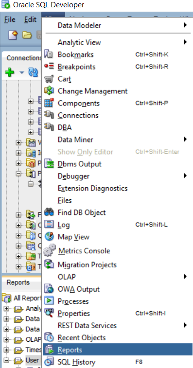
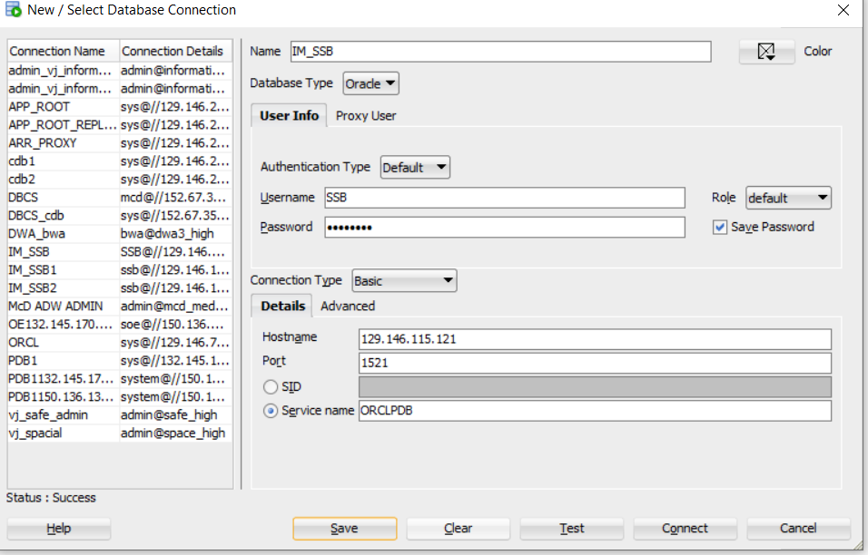
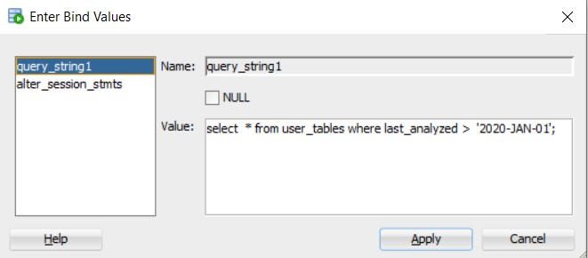

# In-Memory Tool

## Introduction

 In this Lab, we will compare the performance of sql queries running with and without Database In-Memory. To automate this comparison we are providing Sql Developer "User Defined Reports".

 These reports are also available on  [github](https://raw.githubusercontent.com/vijaybalebail/In-memory-workshop/master/In_memory/sqlDev/InMemoryPOC.xml) for you to use in your own test environments.


## Install

The SQL In-Memory POC tool is loaded into Sql\*Developer as a "User Defined Reports".

1. Download the Report script from [your Browser](https://raw.githubusercontent.com/vijaybalebail/In-memory-workshop/master/In_memory/sqlDev/InMemoryPOC.xml). Then right click and choose "save as"  to save the XML file.


2. Open Sql*Developer and click on Views--> Reports


3. Under "User Defined Reports", Right click and select "Open Report". Open the xml file saved in step 1.


That is it. You have installed the In-Memory POC tool. Next, we need to connect to the test environment.

4. Add a New Connection. Click on the "+" icon in the upper left corner under connections window frame.
    

     We will run Queries as SSB/Ora_DB4U user for service orclpdb.
    
    Click the "Test" button and if successful click "Save" to save the connection alias.

5. Expand the "User Defined report" --> "InMemory POC tool" and click "Load Runstats" and choose the connection you just created. When you run it for the first time, you will get the following message displayed.

 ````
  As a sys user please grant access to following tables and run again
  grant select on SYS.V_$STATNAME to SSB;
  grant select on SYS.V_$MYSTAT to SSB;
  grant select on SYS.V_$TIMER to SSB;
  grant select on SYS.V_$LATCH to SSB;
  grant select on SYS.V_$SESSTAT to SSB;
  Table Created
  ORA-01031: insufficient privileges
  package recompiled in user SSB
  ORA-24344: success with compilation error
 ````

To add privileges, open a terminal window and start  sql\*plus.
````
  <copy>
  connect / as sysdba
  alter session set container=ORCLPDB;
  grant select on SYS.V_$STATNAME to SSB;
  grant select on SYS.V_$MYSTAT to SSB;
  grant select on SYS.V_$TIMER to SSB;
  grant select on SYS.V_$LATCH to SSB;
  grant select on SYS.V_$SESSTAT to SSB;
  </copy>
````
After granting the privileges, re-run the "Load Runstats"
After about 10 seconds, you should get the following display.

````
  temp table run_stats is already created
  view recreated
  package recompiled in user SSB
  Package body recompiled in user SSB
  You are ready to run the report
````
At this point, you have successfully imported the user defined report and installed the package.

## Verify the objects are Loaded.
Click on the report "in-memory-objects"
This displays the tables that have the property INMEMORY setup and loaded into In-Memory pool. In our test ensure you see LINEORDER,PART,CUSTOMER,DATE_DIM,SUPPLIER. If there are not show here, you can run the report "Load all inmemory tables".


The chart shows the space it used in In-Memory compared to space occupied in buffer. Notice, that space in In-Memory is less than in buffer. Further, due to various compression levels, you could tune the compression level to fill the pool more economically.

## Run SQL Query
Now that the tool is installed, Click on "In-Memory Query vs  Buffer Cache".
In the popup , enter the following query to see the performance difference, SQL Plan and stats.

````
<copy>
select
lo_orderkey,
lo_custkey,
lo_revenue
from
LINEORDER
where
lo_custkey = 5641
and lo_shipmode = 'XXX AIR'
and lo_orderpriority = '5-LOW'; </copy>
````

 Click "Apply"

 We will see the tool display the following .
 ````
     query string is :
    select
    lo_orderkey,
    lo_custkey,
    lo_revenue
    from
    LINEORDER
    where
    lo_custkey = 5641
    and lo_shipmode = 'XXX AIR'
    and lo_orderpriority = '5-LOW'

    IN MEMORY PLAN
    Plan hash value: 4017770458

    ----------------------------------------------------------------------------------------
    | Id  | Operation                  | Name      | Rows  | Bytes | Cost (%CPU)| Time     |
    ----------------------------------------------------------------------------------------
    |   0 | SELECT STATEMENT           |           |     1 |    44 |  9459   (2)| 00:00:01 |
    |*  1 |  TABLE ACCESS INMEMORY FULL| LINEORDER |     1 |    44 |  9459   (2)| 00:00:01 |
    ----------------------------------------------------------------------------------------

    Predicate Information (identified by operation id):
    ---------------------------------------------------

       1 - inmemory("LO_CUSTKEY"=5641 AND "LO_SHIPMODE"='XXX AIR' AND
                  "LO_ORDERPRIORITY"='5-LOW')
           filter("LO_CUSTKEY"=5641 AND "LO_SHIPMODE"='XXX AIR' AND
                  "LO_ORDERPRIORITY"='5-LOW')

    BUFFER CACHE PLAN
    Plan hash value: 4017770458

    -------------------------------------------------------------------------------
    | Id  | Operation         | Name      | Rows  | Bytes | Cost (%CPU)| Time     |
    -------------------------------------------------------------------------------
    |   0 | SELECT STATEMENT  |           |     1 |    44 | 91044   (1)| 00:00:04 |
    |*  1 |  TABLE ACCESS FULL| LINEORDER |     1 |    44 | 91044   (1)| 00:00:04 |
    -------------------------------------------------------------------------------

    Predicate Information (identified by operation id):
    ---------------------------------------------------

       1 - filter("LO_CUSTKEY"=5641 AND "LO_SHIPMODE"='XXX AIR' AND
                  "LO_ORDERPRIORITY"='5-LOW')

    .09 sec in memory, 1.02 sec in SGA ----
    11 X times faster


    Run #  01 ran in .09  seconds
    Run #  02 ran in 1.05  seconds
    ###########################################################################
     Statistics                               | inmemory       | buffer        
    ###########################################################################
    CPU used by this session................ |              9 |            106
    HSC Heap Segment Block Changes.......... |              0 |              2
    IM SubCU-MM CUs Examined................ |              6 |              0
    IM SubCU-MM CUs Selected................ |              3 |              0
    IM SubCU-MM SubCUs Eliminated........... |          2,648 |              0
    IM SubCU-MM SubCUs in Selected CUs...... |          3,108 |              0
    IM scan CUs columns accessed............ |              8 |              0
    IM scan CUs columns theoretical max..... |            748 |              0
    IM scan CUs current..................... |             44 |              0
    IM scan CUs invalid or missing revert to |             16 |              0
    IM scan CUs memcompress for query low... |             44 |              0
    IM scan CUs no cleanout................. |             44 |              0
    IM scan CUs pcode pred evaled........... |             10 |              0
    IM scan CUs pcode selective done........ |              4 |              0
    IM scan CUs predicates applied.......... |             90 |              0
    IM scan CUs predicates optimized........ |            126 |              0
    IM scan CUs predicates received......... |            132 |              0
    IM scan CUs pruned...................... |             42 |              0
    IM scan CUs readlist creation accumulate |              9 |              0
    IM scan CUs readlist creation number.... |             44 |              0
    IM scan CUs split pieces................ |             65 |              0
    IM scan bytes in-memory................. |  1,386,345,809 |              0
    IM scan bytes uncompressed.............. |  2,134,966,644 |              0
    IM scan delta - only base scan.......... |             44 |              0
    IM scan rows............................ |     22,417,090 |              0
    IM scan rows optimized.................. |     21,365,119 |              0
    IM scan rows projected.................. |              1 |              0
    IM scan rows valid...................... |      1,051,971 |              0
    IM scan segments disk................... |              0 |              1
    IM scan segments minmax eligible........ |             44 |              0
    IM simd compare calls................... |             18 |              0
    IM simd compare selective calls......... |              1 |              0
    IM simd decode symbol calls............. |              3 |              0
    IM simd decode unpack calls............. |              3 |              0
    IM simd decode unpack selective calls... |              3 |              0
    buffer is not pinned count.............. |              2 |             19
    calls to get snapshot scn: kcmgss....... |              2 |             17
    calls to kcmgcs......................... |              2 |             30
    consistent changes...................... |              0 |              2
    consistent gets......................... |         25,154 |        333,545
    consistent gets examination............. |              0 |              1
    consistent gets examination (fastpath).. |              0 |              1
    consistent gets from cache.............. |         25,154 |        333,545
    consistent gets pin..................... |         25,154 |        333,544
    consistent gets pin (fastpath).......... |         25,154 |        333,544
    db block changes........................ |              0 |              4
    db block gets........................... |              0 |              2
    db block gets from cache................ |              0 |              2
    db block gets from cache (fastpath)..... |              0 |              2
    enqueue releases........................ |              1 |              6
    enqueue requests........................ |              1 |              6
    execute count........................... |              2 |             17
    index fetch by key...................... |              0 |              1
    lob writes.............................. |              0 |              1
    lob writes unaligned.................... |              0 |              1
    logical read bytes from cache........... |    206,061,568 |  2,732,417,024
    no work - consistent read gets.......... |         25,152 |        333,514
    non-idle wait count..................... |              3 |              2
    opened cursors cumulative............... |              2 |             17
    parse count (hard)...................... |              0 |              1
    parse count (total)..................... |              1 |             14
    parse time cpu.......................... |              0 |              1
    parse time elapsed...................... |              0 |              1
    recursive calls......................... |              9 |            123
    recursive cpu usage..................... |             10 |            105
    redo entries............................ |              0 |              2
    redo size............................... |              0 |            340
    session cursor cache hits............... |              2 |             13
    session logical reads - IM.............. |        311,540 |              0
    session pga memory...................... |        262,144 |     -1,769,472
    session uga memory...................... |            -40 |             40
    sorts (memory).......................... |              1 |              2
    table fetch by rowid.................... |              0 |              1
    table scan blocks gotten................ |         25,152 |        333,513
    table scan disk IMC fallback............ |      1,809,733 |              0
    table scan disk non-IMC rows gotten..... |              0 |     23,996,826
    table scan rows gotten.................. |      2,861,704 |     23,996,976
    table scan rs2.......................... |              1 |              0
    table scans (IM)........................ |              1 |              0
    table scans (short tables).............. |              1 |              3
    undo change vector size................. |              0 |            136
    workarea executions - optimal........... |              3 |              4
    workarea memory allocated............... |             11 |            -13
    ###########################################################################
 ````
 From the generated report, observe the SQL PLAN operation "*TABLE ACCESS INMEMORY FULL*" when INMEMORY is enabled and "*TABLE ACCESS FULL*" when disabled.

 Now look at the relevant DB stats to see the In-Memory optimizations.


Some sql queries will need to set session parameters like Parallel Degree, Hint like invisible indexes, optimizer tuning parameters and NLS date formats. We already tested one query by enabling invisible index in our test. We can now run it again in Sql Developer.

Click and open "InMemory vs Buffer with Session Parameter" enter the query_string ..
````
<copy>
Select  /* Demo  */ lo_orderkey, lo_custkey, lo_revenue
From    LINEORDER Where   lo_orderkey = 5000000;
</copy>
````



Next click in the "alter\_session\_stmt" and enter the session information.

````
<copy>
 alter session set optimizer_use_invisible_indexes=true;
</copy>
````


From the report, we observed that, when we have a favorable index, the optimizer choose "index Range Scan" over full tablespace even when In-Memory is enabled. This is the same result we observed in Lab 03. Step 4-5.

Next we can see other useful reports which could help during a POC.


## Top InmemorySQL report


You can click on TopSqLInMemory report. The report show top few sql queries which ran InMemory atleast once. Since the tool runs the SQL once InMemory and once without it, you will find average execution time for all plans and execution times.

## Approximate Query Processing and InMemory.

While InMemory is highly efficient in query filtering, min-max pruning and InMemory indexing, the query can further improve performance using "Approximate Query Processing" as a complimentry feature. They are features to improve performance of sort operations like DISTINCT, RANP, PERCENTILE, MEDIAN . These operations happen in the Process Global Area (PGA) of a user sessions. Since 12c, oracle has "approximate query processing" features that can make sorting operations faster but can be 95% or more accurate. For more information about this feature check out the  **[documentation.](https://docs.oracle.com/en/database/oracle/oracle-database/19/tgsql/query-optimizer-concepts.html#GUID-6273DFAC-7C4D-4540-AE11-B6973F237323)**
This type of approximation is useful in certain Dashboards, BI applications where data needs to be real time, but small variance in dataset does not distort the visualizations of data.

In 12.2 there are several APPROX functions introduced:
- APPROX_COUNT_DISTINCT_DETAIL
- APPROX_COUNT_DISTINCT_AGG
- TO_APPROX_COUNT_DISTINCT
- APPROX_MEDIAN
- APPROX_PERCENTILE
- APPROX_PERCENTILE_DETAIL
- APPROX_PERCENTILE_AGG
- TO_APPROX_PERCENTILE

 “Approximate query processing is primarily used in data discovery applications to return quick answers to explorative queries. Users typically want to locate interesting data points within large amounts of data and then drill down to uncover further levels of detail. For explorative queries, quick responses are more important than exact values.”

The interesting part is that you can utilize the Approximate functions without changing code. There are three initialization parameters introduced to control which functions should be treated as an approximate function during run time.

The initialization parameters are:

- approx_for_aggregation (TRUE|FALSE)
- approx_for_count_distinct (TRUE|FLASE)
- approx_for_percentile  (ALL| NONE | PERCENTILE_CONT | PERCENTILE_CONT DETERMINISTIC | PERCENTILE_DISC | PERCENTILE_DISC DETERMINISTIC | ALL DETERMINISTIC )

To test this, let use first run the below query from sql-Dev tool "InMemory Query vs Buffer"
````
<copy>
select lo_custkey, median(lo_ordtotalprice) from lineorder
group by  lo_custkey ;
</copy>
IN MEMORY PLAN
Plan hash value: 4230308389

-------------------------------------------------------------------------------------------------
| Id  | Operation                   | Name      | Rows  | Bytes |TempSpc| Cost (%CPU)| Time     |
-------------------------------------------------------------------------------------------------
|   0 | SELECT STATEMENT            |           | 80504 |   864K|       | 39801   (3)| 00:00:02 |
|   1 |  SORT GROUP BY              |           | 80504 |   864K|   459M| 39801   (3)| 00:00:02 |
|   2 |   TABLE ACCESS INMEMORY FULL| LINEORDER |    23M|   251M|       |  2045  (12)| 00:00:01 |
-------------------------------------------------------------------------------------------------

Run #  01 ran in 67.8  seconds
Run #  02 ran in 96.19  seconds
````
InMemory query still took less time than buffer. Now run the same query with approx_for_percentile set in session level.
Run the same SQL query  sql-Dev tool "InMemory Query vs Buffer with sessions"

For the query string, enter the same query.
<copy>
select lo_custkey, median(lo_ordtotalprice) from lineorder
group by  lo_custkey ;
</copy>
And for the second parameter "alter_session_statement" enter the following.
<copy>
ALTER SYSTEM SET approx_for_count_distinct = TRUE;
ALTER SESSION SET approx_for_aggregation = TRUE;
ALTER SESSION SET APPROX_FOR_PERCENTILE=all;
</copy>
````
Plan hash value: 3675673598

-------------------------------------------------------------------------------------------------
| Id  | Operation                   | Name      | Rows  | Bytes |TempSpc| Cost (%CPU)| Time     |
-------------------------------------------------------------------------------------------------
|   0 | SELECT STATEMENT            |           | 80504 |   864K|       | 39801   (3)| 00:00:02 |
|   1 |  HASH GROUP BY APPROX       |           | 80504 |   864K|   459M| 39801   (3)| 00:00:02 |
|   2 |   TABLE ACCESS INMEMORY FULL| LINEORDER |    23M|   251M|       |  2045  (12)| 00:00:01 |
-------------------------------------------------------------------------------------------------

Run #  01 ran in 28.6  seconds
Run #  02 ran in 56.69  seconds
````
Observe that the plan has HASH GROUP BY APPROX instead of "SORT GROUP BY"
And the InMemory query tool about 28 seconds which is lesser than the previous InMemory runs.
This feature also speeds up In Buffer runs too.

## InMemory Materialized Views and Query Rewrite.

The best SQL plans are the once where we don't have to do any work to get the result. Oracle Materialized Views has been one of the solutions for BI Dashboards and Data warehouse reports for a while. Oracle Introduced automatic query rewrite that automatically use Materialized Views when available to speed the query.
As we observed InMemory is very efficient in Data filtering and Vector Join plans for speeding the joins. However, if these joins and aggradations are precomputed, it would help us avoid accessing the underlying table until the data is altered. Adding Materialized View Logs can help capture the delta and refresh faster. However, it could have a slight impact on CPU resources during DML operations.
With the support of these Materialized Views be loaded into InMemory pool, we can now access the pre computed joins and aggressions from InMemory.

Let us test this out.
For the same query we ran earlier, we can create a MV and see the performance difference. From sql*prompt or sql*developer worksheet, run the following creation script.
````
<copy>
DROP Materialized view MV_median ;
CREATE MATERIALIZED VIEW MV_median INMEMORY PRIORITY HIGH
BUILD IMMEDIATE
--REFRESH FORCE ON COMMIT
ENABLE QUERY REWRITE
AS
select lo_custkey, median(lo_ordtotalprice) from lineorder
group by  lo_custkey ;
</copy>
````

Run the sql report "In-Memory Query vs in Buffer Cache" and pass the below query.
````
<copy>
select lo_custkey, median(lo_ordtotalprice) from lineorder
group by  lo_custkey ;
</copy>
````
The output below.
````
query string is :
select lo_custkey, median(lo_ordtotalprice) from lineorder
group by  lo_custkey

IN MEMORY PLAN
Plan hash value: 835373166

---------------------------------------------------------------------------------------------------
| Id  | Operation                             | Name      | Rows  | Bytes | Cost (%CPU)| Time     |
---------------------------------------------------------------------------------------------------
|   0 | SELECT STATEMENT                      |           | 80000 |   859K|     3  (34)| 00:00:01 |
|   1 |  MAT_VIEW REWRITE ACCESS INMEMORY FULL| MV_MEDIAN | 80000 |   859K|     3  (34)| 00:00:01 |
---------------------------------------------------------------------------------------------------

BUFFER CACHE PLAN
Plan hash value: 835373166

------------------------------------------------------------------------------------------
| Id  | Operation                    | Name      | Rows  | Bytes | Cost (%CPU)| Time     |
------------------------------------------------------------------------------------------
|   0 | SELECT STATEMENT             |           | 80000 |   859K|    54   (2)| 00:00:01 |
|   1 |  MAT_VIEW REWRITE ACCESS FULL| MV_MEDIAN | 80000 |   859K|    54   (2)| 00:00:01 |
------------------------------------------------------------------------------------------

0 sec in memory, 0 sec in SGA ----
0 X times faster


Run #  01 ran in 0  seconds
Run #  02 ran in .02  seconds
````
The query that had taken 28 seconds earlier when doing direct path load query. InMemory takes about 20 millisecond to get data from Buffer compared to less than a millisecond for InMemory Materilized view.
MVs with query rewrite is powerful as a feature. But when these MVs are inmemory the performance is much more.

For more information about this, check out Oracle **[documentation.](https://docs.oracle.com/en/database/oracle/oracle-database/19/dwhsg/basic-query-rewrite-materialized-views.html#GUID-DB76286B-8557-446B-A6CC-BC987C378076)**

## Result Caching and InMemory

We saw that materialized views can rewrite any SQL queries that use the underlying join condition or aggregation, Result Caching is a layer above this. This can save the result at a SQL statement level and for each bind value.  This can run over MATERIALIZED views or just over Tables. While it is not part of InMemory workshop, it is none the less one of the features that can improve performance of BI reports and dashboards type of applications.
