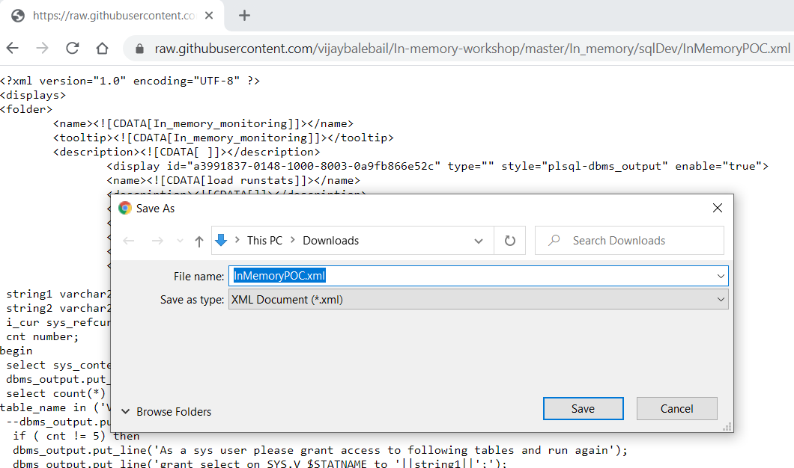

# In-Memory Tool

## Introduction

Oracle In-Memory is relatively new. There are many expert and novice DBAs alike who would like to test their application SQL statements In-Memory and in buffer and understand the inner workings.

If we are doing a benchmark of Database with In-Memory enabled and disabled, it is not quiet obvious how Individual performance gains have contributed to the overall performance, In this Lab, we will look at a tool to run individual queries and see how it behaves with In-Memory and without it.

The tool has been developed using Sql\*Developer "User defined reports". The scripts can be plugged-in to any Sql\*Developer and the user can quickly connect to the schema and run the monitoring and diagnostic reports.  

The major capability of the tool is

1)  to run any give sql statement with in-memory ENABLED and  DISABLED and display the 2 different sql plans and stats. All the statistics that changed during the execution of the sql statement are displayed side-by-side. The unique features is that it can keep the same sql_id for the sql statment as the tool will not alter the statement in any way. (like adding a HINT or count in front of the sql).  Also, it only fetches the first 10 rows and stops. This will ensure you are only counting the DB time and not network time to move large amount of data.

2) It also has  provision to add multiple session level information to run statements like "alter session set nls\_date\_format ...;alter session....; " This will help if the sql queries expect date to be of a certain format so that you need not add to_date syntax. Also, you can add other tunable parameters like parallel degrees,APPROX\_FOR\_AGGREGATION,etc.

3) Show barchart of execution times when run in Buffer and In-Memory.

4) Show barchart of space it would occupy in buffer compared to In-Memory.

5) Show Barchart of different memory pools in SGA and PieChart of memory used by In-Memory tables.

## Installation

The SQL In-Memory POC tool is loaded as a User defined report in Sql\*Developer. You can download Sql\*Developer in the test environment.

1. Download the XML file from [your Browser](https://raw.githubusercontent.com/vijaybalebail/In-memory-workshop/master/In_memory/sqlDev/InMemoryPOC.xml) and save as a XML file.

2. Open Sql*Developer Click on Views--> reports

3. In the reports window, Right click and select "Open Report". Open the xml file saved in step 1.

That is it. You have installed the In-Memory POC tool. Next, we we need to connect to the test environmen. 

And point to the XML file you downloaded.
Once the POC reports are installed, create a connecting in sqlDeve as the use that is running the POC . Click on the Load Runstats Report.
The install will have created three objects:A global temporary table called run_statsA view called statsA plsql package called runstats_pkg
